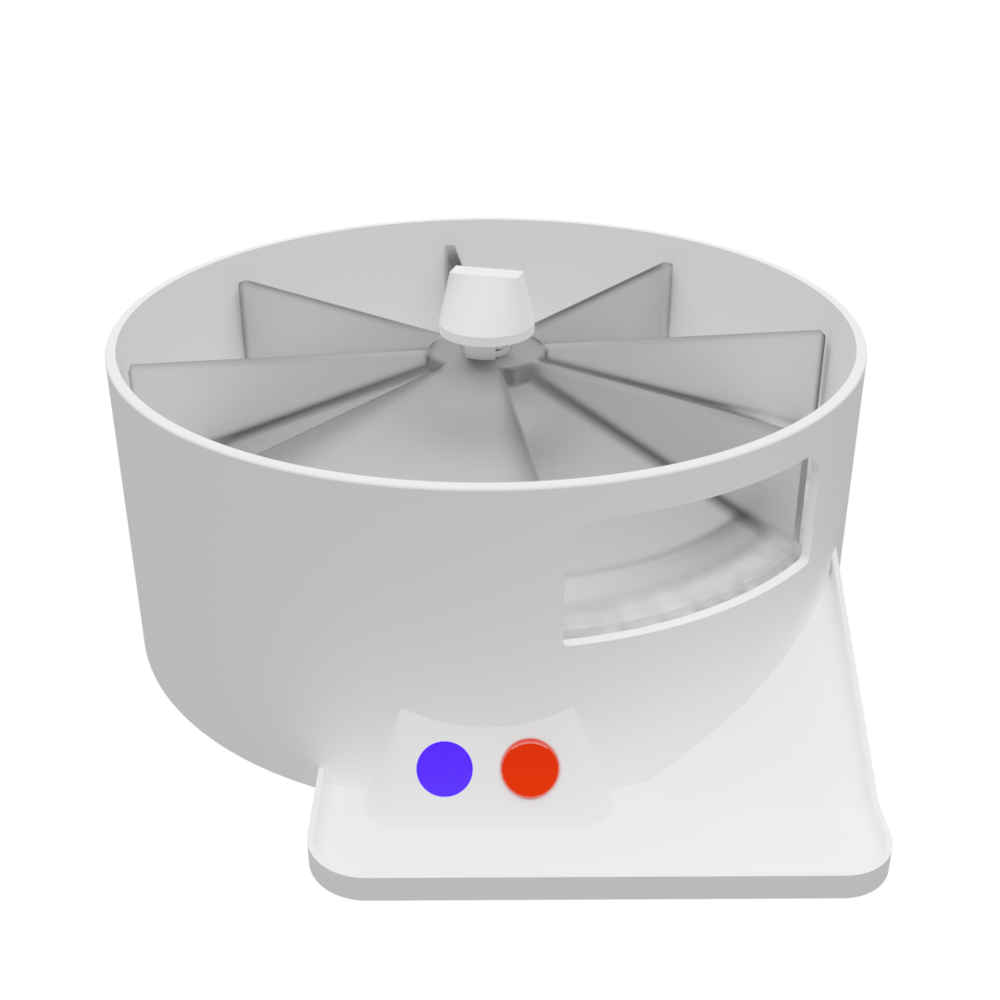
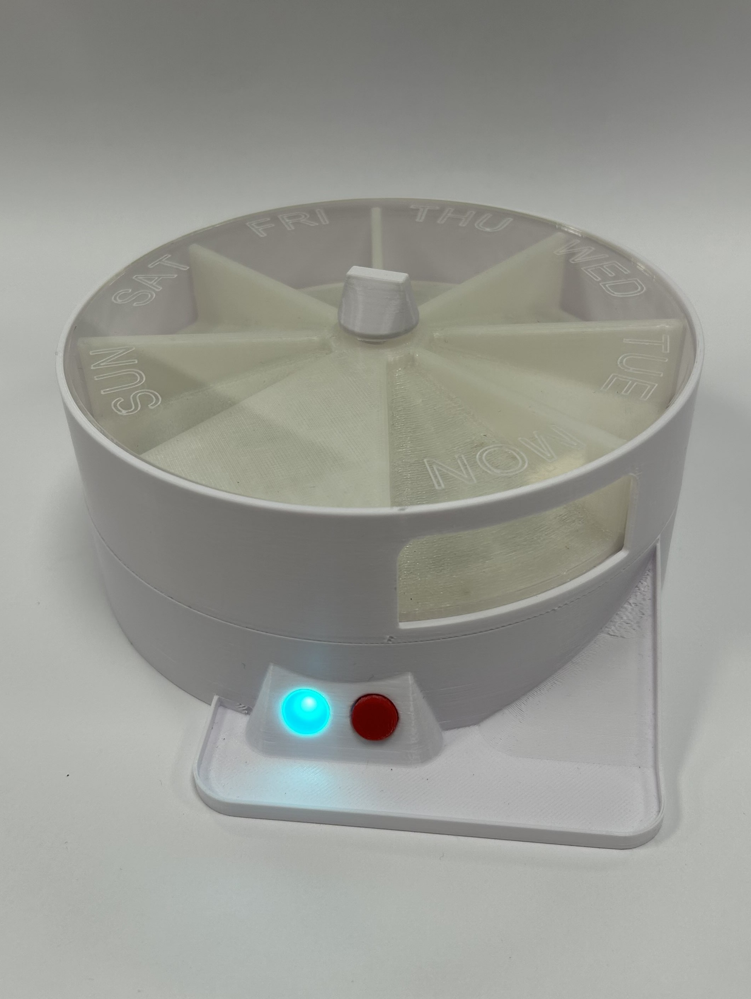
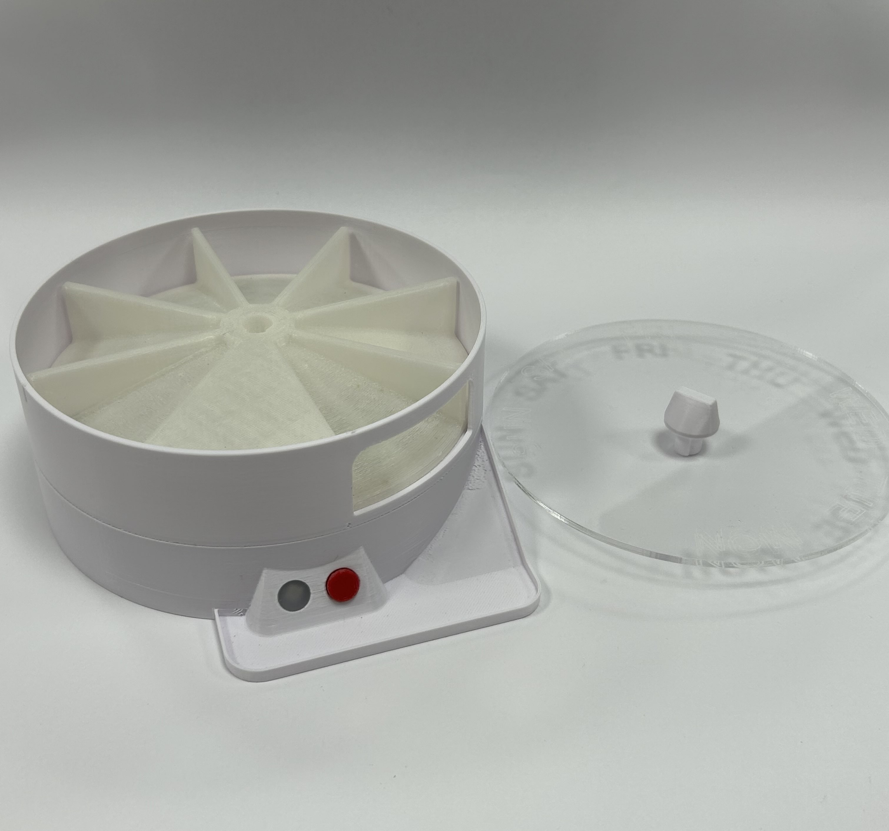
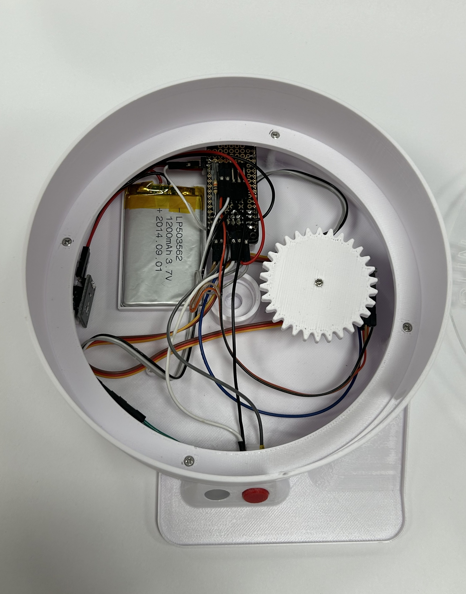

# BLE ESP32 Pill Dispenser

## Overview

This project is for a lecture in Digital Fabrication. It is supposed to cover one of the 17 UN goals, of which we chose _3. Good health and well-being_. The project is a battery-powered rotary pill dispenser for daily medicine or supplement intake. Of course, this is **only for educational purposes**, so we do not recommend the useage of this repository with real medicine! But please do fill it up with your favorite candy.

The project features to main parts: The digitally fabricated pill dispenser powered by an **Adafruit ESP32 Feather** and an **Android Flutter App** for showing device status and controlling settings over **Bluetooth Low Energy**

## Design and operation

The device was made to be compact but still visually pleasing. To keep everything minimal, the pill dispenser can be operated with only a single button. A single press will wake up the device from deep sleep, dispense a pill and shut off any running alarms. The dispensed pill drops in a small pan below and is ready for consumption. After emptying the device, it will automatically move into the starting position. A removable acrylic lid at the top allows refilling contents after emptying.

A long press of at least 3 seconds will enable bluetooth pairing mode and lets consequently any Phone searching for devices connect for up to 30 seconds. After this time, the device will hibernate. More information on bluetooth functionality can be found together here: [`flutter-ui/`](flutter-ui/ "Flutter UI"). While in pairing mode, another long press will reset the device to its initial position.

The device can be charged using a common micro USB charging port at the back.

To test all functions, a test mode can be activated by pressing the button 3 times in the time span of a second, while in pairing mode. After trying various functions, the LED will turn purple and the servo can be thoroughly tested by button presses. The device will not shut off in this mode, and needs to be manually reset by another long button press.

## Fabrication

Most parts were 3d printed because of the possibility to create a nice and rounded appearance and a lot of flexibility for mounting parts on the inside using only screws. These parts only required minimal support structures and minimal infill to reduce weight and material usage.

Two parts however, required laser cutting. The front cover of the signal LED has a opaque, clean acrylic cover for a pleasing glowing effect. The removable cover on the top is transparent acrylic with the the week days engraved onto the surface. This way the contents of the dispenser can be easily checked and kept an overview of.

To make the carousel move in a robust way, a small metal rod is used as a connection to a ball bearing mounted to the base part.

All fusion files and svgs can be found in `fabrication/`.

## Hardware

As earlier mentioned, the device consists of mainly an **Adafruit ESP32 Feather**. With the development boards built-in battery-charger a 1200mAh LiPo battery the device can run off the battery and recharged at a charging port at the back. The front features a RGB color status signal (Adafruit NeoPixel Flora V2) and a button (classic tiny Omron tacticle switch) that can wake-up the ESP from deep-sleep and more actions. An internal piezo buzzer on the left of the device is used for sound feedback / alarms. A real-time clock is also able to wake-up the ESP32 from deep-sleep, start an alarm and more depending on the settings. The pill carousel is turned by a micro servo (Tower Pro SG90) with power straight from the (protected) lipo battery.

Everything is interfaced using pre-existing libraries found in the Arduino IDE and combined in a class that represents the device. Interactive feedback, such as LED blinking or the piezo buzzer alarm, are run on the ESP32s 2nd core using Tasks. This way, the device can still react to button presses while sounding an alarm or showing a blinking LED. 

Bluetooth LE logic and button logic are all implemented in the main Arduino project .ino file and interface the mentioned class directly. After 30 seconds of no bluetooth connection the device goes into hibernation to reduce power consumption to a minimum. However, due to the way the ESP32 Feather is designed, it still has a rather large current draw, since the USB-Serial module is still powered resulting in around max. 2-3 days battery runtime according to the self-measured current consumption of ~9mA in hibernation (without servo & peripherals ~7mA).

The full code for the firmware can be found in `firmware/`
