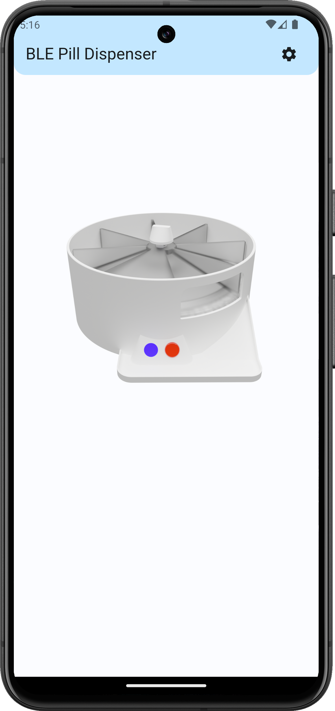

# Pill Dispenser Connect

Flutter app for an ESP32 pill dispenser.

As with the typical structure of flutter projects, all self-written code is in `lib/`

## Getting Started

Install the app on your android phone from the release section on the right or

Build the app by yourself using `flutter build apk --split-per-abi`

NOTE: Most modern android phones today use the arm64 abi, so choose that version preferably.

## Usage

The app is pretty straightforward to use.

Starting the app, it will search for any pill dispenser device that is in Bluetooth pairing-mode and immediately connect if it finds one.

On the topmost Appbar the device name will be shown after connection. On the top-right corner there is a button to show any device options.

The flipcard in the center of the screen shows a 3D render of the pill dispenser and will flip and show the current turning- and battery-status of the device. 

<figure>
  
  
</figure> 

Additionally there is an option to rename the device (Utf-8 compatible, so most international symbols and emojis are supported).

The options are mostly self-explanatory. The first one turns on the alarm function to automatically wakeup the device at a time specified in the second row.

The _Alarm sound_ enables the beeping tone that is played at the wakeup time. This sound will ring for until confirmed by a button press on the device or stop automatically depending on _Ring until confirmation_.

_Turn automatically_ enables automatic turning and therefore dispensing of a pill at wakeup. _Block for 16h_ is independent of _Enable alarm_ and will block the dispensing function for a limited time of 16h. This could be practical for avoiding high doses of medicine or supplements.

<figure>
  
</figure>

*Note*: Every option you see is live synced from and to the device, so animations might be slightly delayed and not as pretty.

